<div align="center">

<h1>maxgus</h1>

<h3><em>A vibe-written lightweight editor inspired on emacs</em></h3>

<p>
Emacs keys, buffers and windows&nbsp; ·&nbsp; tree-sitter highlighting&nbsp; ·&nbsp; a language-server client<br>
themes you rewrite in a config file&nbsp; ·&nbsp; a treemacs-style file tree&nbsp; ·&nbsp; async throughout, on tokio
</p>

<p>
<a href="https://github.com/alejandro-llanes/maxgus-editor/actions/workflows/release.yml"></a>
<a href="https://github.com/alejandro-llanes/maxgus-editor/releases/latest"></a>
<a href="https://www.rust-lang.org"></a>
<a href="LICENSE"></a>
<a href="https://alejandrollanes.com/maxgus-editor/"></a>
</p>

<p>


</p>

<sub><b>No Lisp interpreter. No plugin runtime.</b> ~56,000 lines · fifteen crates · three builds to pick from.</sub>

<br><br>

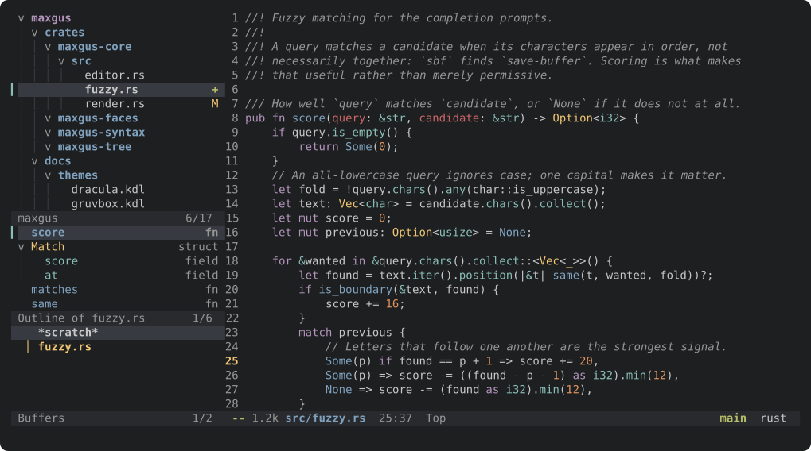

</div>

<br>

```console
$ maxgus src/main.rs
```

`C-h t` opens a guide, `C-h b` lists every binding, `C-x C-c` leaves.

---

## Install

```console
$ curl -fsSL https://alejandrollanes.com/maxgus-editor/install.sh | sh
```

That fetches the `full` build for this machine, checks it against the
checksum published beside it, and puts it in `~/.local/bin` — or
`/usr/local/bin` where that is writable. Nothing else: no daemon, no package
manager, no shell profile rewritten behind your back.

**Three builds**, and `--build` says which:

```console
$ curl -fsSL .../install.sh | sh                          # full, the default
$ curl -fsSL .../install.sh | sh -s -- --build minimal
$ curl -fsSL .../install.sh | sh -s -- --build gui
```

`--prefix DIR` puts it somewhere else, `--version vX.Y.Z` fetches an older
release, `--dry-run` says what it would do and stops.

It also writes **a configuration and the themes** into
`~/.config/maxgus` — `config.kdl`, the four themes that ship, and the
reference — and **never over a file that is already there**, so running it
again to upgrade leaves everything you have edited alone. The `gui` build
additionally gets **an application-menu entry**, with the binary's absolute
path in it, because a launcher does not see your shell's `PATH`.
`--no-config` and `--no-desktop` skip either.

### Which build

| | `minimal` | `full` *(default)* | `gui` |
|---|:---:|:---:|:---:|
| **Binary** | **4.6M** | **13M** | **20M** |
| **Commands** | 297 | 446 | 446 |
| **Needs from the system** | nothing | nothing | a window system's headers |
| Emacs keys, prefix arguments, the mark ring | ● | ● | ● |
| Buffers, windows, `C-x` everything | ● | ● | ● |
| The file tree, with treemacs' keys | ● | ● | ● |
| The side panel — tree and buffer list | ● | ● | ● |
| The side panel — symbol outline | ○ | ● | ● |
| Themes, and the configuration file | ● | ● | ● |
| which-key | ● | ● | ● |
| beacon | ● | ● | ● |
| Multiple cursors | ● | ● | ● |
| The undo tree, and its visualiser | ● | ● | ● |
| dired | ● | ● | ● |
| Keyboard macros, registers, rectangles | ● | ● | ● |
| isearch, `query-replace`, `occur` | ● | ● | ● |
| Sessions, snippets, `.editorconfig` | ● | ● | ● |
| **tree-sitter highlighting**, eleven grammars | ○ | ● | ● |
| **Grammars from the system**, loaded at run time | ○ | ● | ● |
| **A language-server client** | ○ | ● | ● |
| **Autocomplete** while typing | ○ | ● | ● |
| **lsp-ui-doc**, beside the cursor | ○ | ● | ● |
| **magit** | ○ | ● | ● |
| **A terminal panel**, in tabs | ○ | ● | ● |
| **Project search**, and editing the results | ○ | ● | ● |
| **Rhai scripting** | ○ | ● | ● |
| **A window**: the GPU, the mouse, the clipboard, smooth scrolling | ○ | ○ | ● |

`minimal` is the editor and the file tree: no grammars, no protocol, no
subprocess, nothing to install. Everything a text editor does, and none of
what a development environment does. It starts instantly and builds in a
fraction of the time.

`full` adds everything that talks to something else. `gui` adds a second
front end drawn by the GPU, and is the only build that needs anything from
the system to compile.

<details>
<summary><b>Or download an archive</b></summary>

Every [release](https://github.com/alejandro-llanes/maxgus-editor/releases/latest)
carries all three builds for Linux (glibc, musl and aarch64), macOS (Intel and
Apple Silicon), Windows and FreeBSD, each with a `.sha256` beside it. The
archives are named `maxgus-<build>-<platform>`:

| Platform | Builds |
|---|---|
| Linux x86_64 (glibc) | `minimal` `full` `gui` |
| Linux x86_64 (static, musl) | `minimal` `full` |
| Linux aarch64 | `minimal` `full` |
| macOS Intel | `minimal` `full` `gui` |
| macOS Apple Silicon | `minimal` `full` `gui` |
| Windows x86_64 | `minimal` `full` `gui` (`.zip`) |
| FreeBSD x86_64 | `minimal` `full` |

There is no `gui` for musl or for the cross-compiled targets: a static binary
cannot load a window system, and cross-compiling against one needs a sysroot
the release does not have.

```console
$ curl -fsSL https://github.com/alejandro-llanes/maxgus-editor/releases/latest/download/maxgus-full-linux-x86_64.tar.gz | tar xz
$ ./maxgus-full-linux-x86_64/maxgus
```

</details>

**Or build it** — Rust stable, edition 2024. `minimal` and `full` need
nothing but a terminal; `gui` needs a window system's headers
(`libwayland-dev` and `libxkbcommon-dev` on Debian and its relatives):

```console
$ git clone https://github.com/alejandro-llanes/maxgus-editor
$ cd maxgus-editor && cargo build --release          # full
$ ./target/release/maxgus
```

> [!NOTE]
> `C-z` job control is POSIX only. On Windows it reports that there is nothing
> to suspend into rather than pretending; everything else is the same editor.

---

## What it does

### Emacs keys, and they behave like Emacs

**397 bindings** across the `C-x`, `C-c`, `C-h`, `M-g` and `M-s` prefixes and
the panel, tree, magit and terminal maps, driving **446 commands**. Prefix
arguments (`C-u`, `M-1`…`M-9`, `M--`), the mark and the mark ring, the kill
ring with `M-y`, registers, keyboard macros, rectangles, narrowing,
incremental and regexp search, `query-replace`, `occur`.

It says how long it took to start, the way `emacs-init-time` does — after the
files named on the command line have finished reporting themselves, so it is
the last thing said rather than the first thing overwritten. `M-x startup-time`
asks again later.

Not a lookalike: `C-k` at the end of a line takes the newline, the first `TAB`
grows to the common prefix and only the second shows the list, `M-a` never
moves forward, and undo groups the way Emacs groups it — one `C-/` undoes a run
of typing, not one character.

### Prompts that tell you what is there

`M-x` opens a bordered popup at the top of the frame. It lists every command
the moment it opens, with the key that runs each one and a line saying what it
does, and a count of where you are in the list:

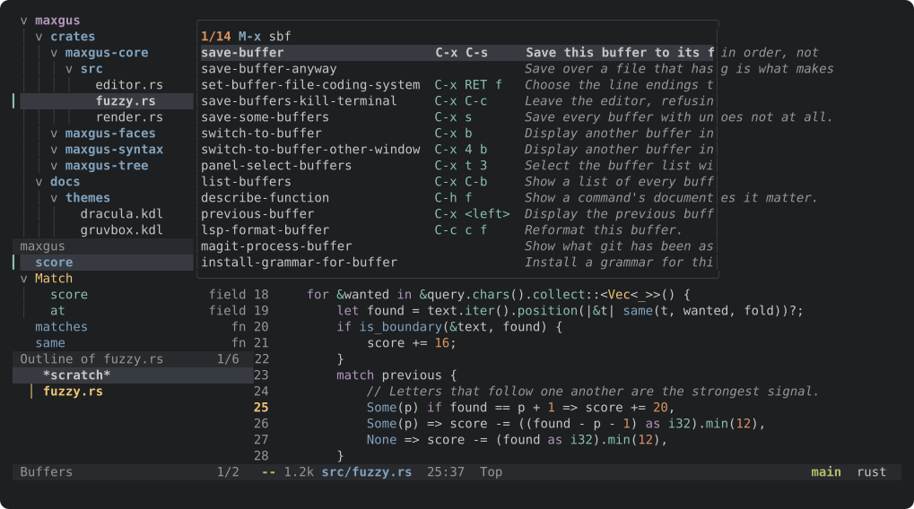

Matching is **fuzzy**: `sbf` finds `save-buffer`, `stb` finds
`switch-to-buffer`. Typing an uppercase letter makes the query case-sensitive.
`<up>` and `<down>` walk the list, `<prior>` and `<next>` move a page at a
time, and `RET` runs whatever is highlighted. `C-n` and `C-p` do the same as
the arrows for anyone who would rather not leave the home row.

The list **scrolls under the box** a row at a time as the highlight passes the
bottom or the top, and **wraps round** at both ends — the row after the last
is the first. The box takes three fifths of the frame, so the buffer stays
readable beside it and the documentation column still has room to say
something.

`C-x b` gets the same popup for buffers, annotated with the file each one is
visiting. `TAB` still completes to the common prefix first, then cycles.

`C-x C-f` is the one prompt that answers with what you typed rather than what
it matched — otherwise you could never create `notes` next to a `notes-2024.md`
— but its list is right there, and `TAB` or the arrows still pick from it.

### Tree-sitter highlighting

Any other language can be coloured by a grammar already installed on the
system — [docs/grammars.md](docs/grammars.md) has the per-platform
instructions and says what loading one means for trust. Nothing is loaded
unless the configuration says where to look.

Grammars for **Rust, Python, JavaScript, JSON, C, HTML, YAML, TOML, INI, XML
and Markdown** compiled
into the binary — nothing to install. Reparsing is incremental and only the
visible region is queried, so editing a 20,000-line file costs about 18 ms per
pause rather than a full parse. Every capture the grammars emit is checked
against a real face by a test, so nothing ships silently uncoloured.

### A language server client

Definitions, references, hover, completion, signature help, rename, formatting,
code actions, document and workspace symbols, and diagnostics in the buffer and
the mode line. Incremental document sync where the server asks for it. Server
requests are answered — including `workspace/applyEdit`, so a server can change
your text and be told whether it worked.

### A mode line worth looking at

What is being edited on the left — state, size, the path within the project,
position — and what the editor knows *about* it on the right, where it can be
glanced at rather than read past:

```
 --  1.2k  maxgus/src/fuzzy.rs  25:37  Top          2  1    main   rust
```

A narrow window drops the right-hand group rather than overlapping the two:
the file being edited is what has to survive.

Nerd Font glyphs throughout, in the tree as well, chosen by file type — Rust,
Python, JSON, an image, an archive. `set nerd-font-icons=#false` turns them off
for terminals without such a font, and everything falls back to plain text.

### Themes you can rewrite without recompiling

Three built in (`maxgus-dark`, `maxgus-light`, `maxgus-term`) and **53 named
faces**, with `inherit`, bold/italic/underline/reverse/dim/strikethrough, and
truecolor degraded to 256 and then 16 colours by what your terminal reports.
`M-x load-theme` switches at runtime and keeps your overrides.

**`M-x visit-theme` tries them on.** Each theme is applied as it comes under
the cursor, so you choose by looking rather than by guessing what a name means.
`C-g` puts back the one you started with. Choose one and it asks whether to
write it into your config file or keep it for this session only — and writing
changes that one setting, leaving the rest of the file exactly as it was.

**A theme is a file you drop in.** Anything in
`~/.config/maxgus/themes/*.kdl` is picked up at startup; `set theme="nord"` is
all the configuration it takes. Four complete ones ship in
[`docs/themes/`](docs/themes), each written entirely in configuration — no
recompiling, no Lisp:

<table>
<tr>
<td width="50%">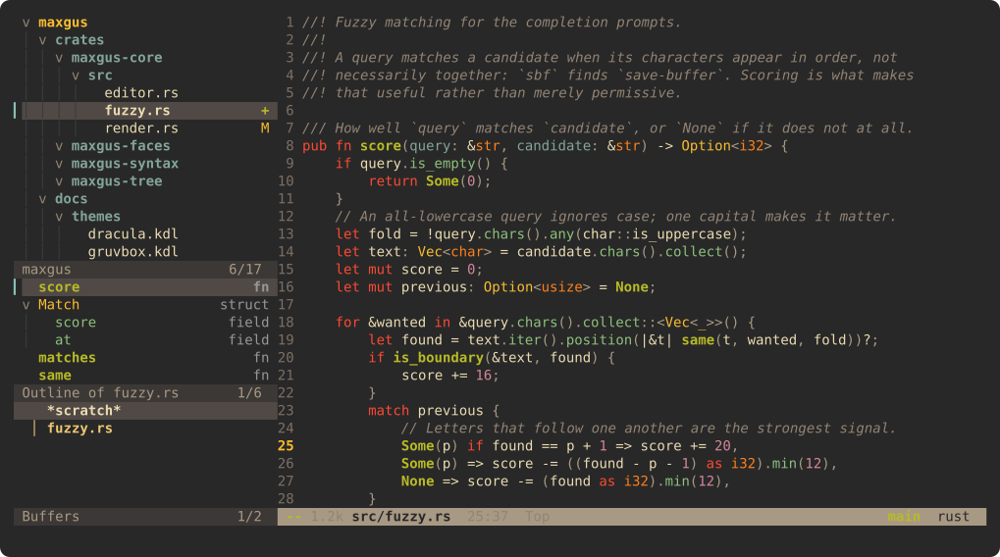<div align="center"><sub><b>Gruvbox</b> · <code>docs/themes/gruvbox.kdl</code></sub></div></td>
<td width="50%">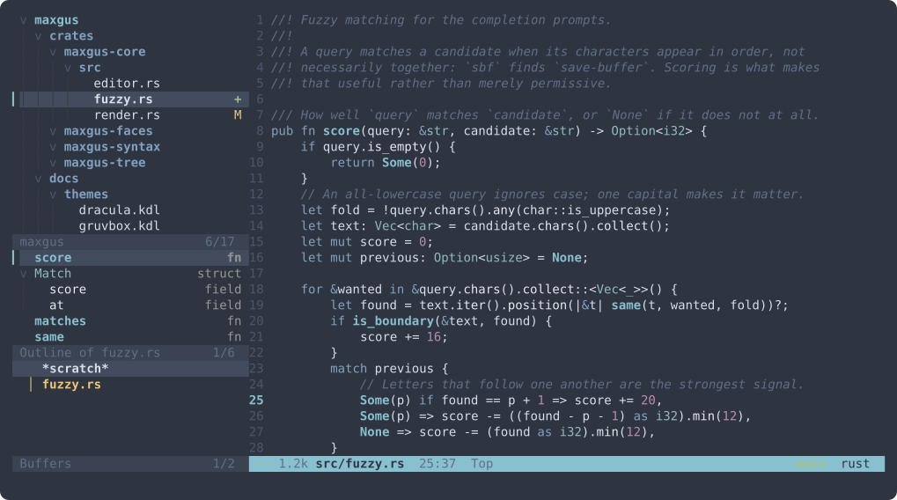<div align="center"><sub><b>Nord</b> · <code>docs/themes/nord.kdl</code></sub></div></td>
</tr>
<tr>
<td width="50%">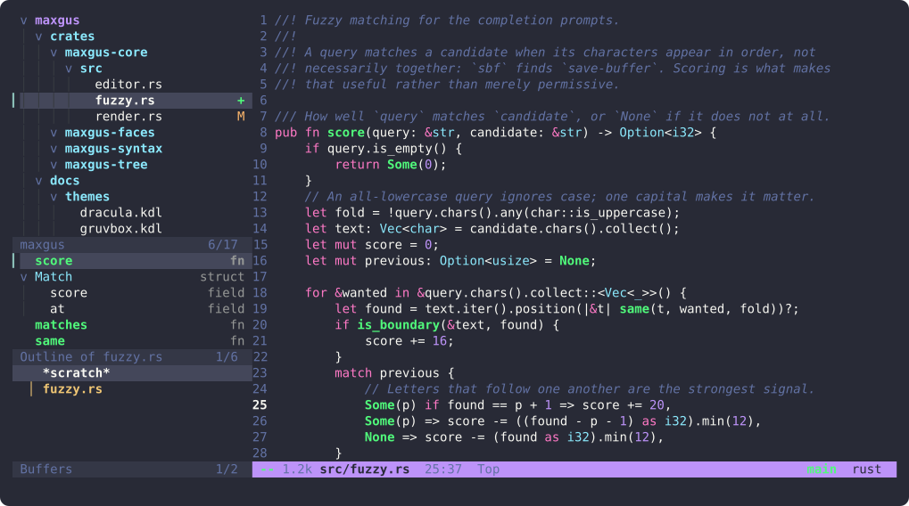<div align="center"><sub><b>Dracula</b> · <code>docs/themes/dracula.kdl</code></sub></div></td>
<td width="50%">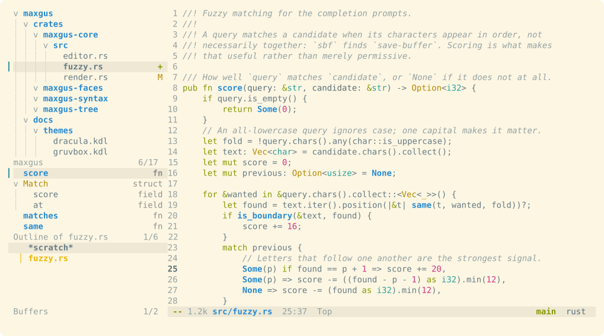<div align="center"><sub><b>Solarized Light</b> · <code>docs/themes/solarized-light.kdl</code></sub></div></td>
</tr>
</table>

<sub>Every picture on this page is drawn by the editor itself —
<a href="crates/maxgus/examples/screenshot.rs"><code>cargo run --example screenshot</code></a>
runs the real redisplay over a real buffer and writes out each cell in the
colour its face resolved to. Nerd Font glyphs are the one thing switched off
for them, so they render in a browser without the font installed.</sub>

### A side panel: files, symbols, buffers

`C-x t t` opens a column of **three windows** down the left — the file tree,
the symbols in the buffer you are editing, and the buffers you have open. Real
windows, not sections of one buffer: each keeps its own point, scrolls on its
own, has its own mode line and its own keymap.


The **symbol outline** comes from the language server and is scoped to the
buffer being edited — switch buffers and it follows. Symbols nest and fold,
`RET` goes to one, and the kind is named beside it. With no server running for
the buffer, the section is not empty: it is **absent**, heading and all.

The **buffer list** marks the one you are editing with a bar and dots the ones
with unsaved changes. `RET` shows a buffer, `k` kills it.

Any section can be switched off — `set panel-symbols=#false`, or `t r`, `t s`
and `t b` inside the panel. The last one standing refuses to go, since an
empty panel is a column of nothing.

Because they are windows, **nothing about moving around them is special**:
`C-<up>` and `C-<down>` walk up and down the column and out of it at either
end, `C-<right>` returns to the file, `C-x o` cycles, `C-x t 1`/`2`/`3` jump
straight to the tree, the outline and the buffer list. `set
panel-at-startup=#true` and the column is there when maxgus opens; give the
outline and the list the height you want with `panel-symbols-height` and
`panel-buffers-height`, and the tree takes whatever is left.

The tree keeps **47 bindings and 41 commands** from treemacs' own keymap:
`n`/`p`, `M-n`/`M-p`, `u`, `TAB`, `RET`, `o v`/`o h`/`o r`/`o x`, `P` to peek,
`c f`/`c d` to create, `R`, `d`, `m`, `!`, `y a`/`y r`/`y p`/`y f` to copy
paths, `t h`/`t w`/`t f`/`t g`/`t d` to toggle, `g r` to refresh. Git status
in the gutter, follow mode, `?` for help.

### Scripts, for the things a config file cannot say

Configuration says what the editor should *be*. A script says what it should
*do*. `~/.config/maxgus/init.rhai` defines commands, and they are commands in
every sense — `M-x` offers them with their documentation, and a keymap can
bind them:

```rhai
fn wrap_in_backticks(ctx) {
    if ctx.region == () { fail("Select something first"); }
    insert(`\`${ctx.region}\``);
}
define("wrap-in-backticks", "Put backticks around the region.", wrap_in_backticks);

fn save_and_format(ctx) {
    run("lsp-format-buffer");
    run("save-buffer");
}
define("save-and-format", "Format, then save.", save_and_format);
```

A script does **not** get the editor. It is told what is on screen — the text,
point, the line and column, the buffer, the file, the mode, the region — and
asks for a list of changes: `insert`, `delete`, `goto`, `message`, `fail`, and
`run`, which is any command the editor already has. That is a deliberate
limit and a useful one: a script can be tested without an editor, one that
fails leaves nothing behind rather than half an edit, and a script can never
take a built-in command's name out from under it.

`M-x reload-scripts` picks up changes without restarting; `M-x
list-script-commands` shows what is defined. A script that will not parse is
reported and the editor carries on — it is an extension, not a prerequisite.
A runaway loop is stopped rather than taking the editor with it.

The language is [Rhai](https://rhai.rs): pure Rust, so it builds everywhere
the editor does, with no C toolchain and no `unsafe`.

### Dired: a directory you can work on

The tree is for browsing a project. `C-x d` is for working on a directory —
marking a dozen files and doing something to all of them:

```
/home/you/project/src  —  12 file(s), 2 director(ies), 84.2k

  ..
  drwxr-xr-x      - Aug 29 15:03 nested/
* -rw-r--r--   2.0k Aug 29 14:22 alpha.rs
D -rw-r--r--    823 Aug 28 09:10 scratch.rs
```

`m` marks and moves on, so a run of files is `m m m`. `u` unmarks, `U` clears
them all, `t` swaps them. `d` flags for deletion and `x` carries the flags
out. `D` deletes, `C` copies, `R` renames or moves, `+` makes a directory, and
`!` runs a shell command with the marked files as its arguments.

Everything acts on what is marked, or on the line point is on when nothing is
— dired's own rule, and the reason marking is worth having rather than being a
mode you enter. Deleting is the one thing that cannot be undone, so it asks
first and says what it is about to lose. The marks survive a refresh, and
point stays on the file it was on rather than on the line it was on.

`RET` opens a file or descends into a directory, `^` goes up, `g` reads the
directory again, `q` closes it.

### Snippets

Type a key and press `TAB`:

```
fori⇥   →   for item in items {
                 ▓▓▓▓
            }
```

The first field is selected, so typing replaces it; `TAB` moves to the next,
`S-TAB` back, `C-g` gives up. `$0` says where to be left at the end.

Snippets live in `snippets/<mode>/` beside the configuration, one file each,
written the way yasnippet writes them — `# key:`, `# name:`, `# --`, then the
body with `$1`, `${2:default}` and `$0`. A set copied out of an Emacs
configuration works unchanged. Files directly in `snippets/` belong to every
mode. `C-c i s` (`M-x insert-snippet`) picks one by name instead.

The body syntax is the language-server protocol's as well as yasnippet's,
which is the same syntax, so a completion that arrives from a server as a
snippet can be inserted as one.

### A light where the cursor went

`set beacon=#true`, and after the cursor jumps — a new buffer, a scroll,
another window — a short bright trail appears beside it and fades away, so the
eye is led to it rather than having to search:

```
line 96 of the file
line 97 of the file
▓▒░ line 98 of the file          ← the light, brightest at the cursor
line 99 of the file
```

This is [beacon](https://melpa.org/#/beacon) replicated: the same shape — a
gradient of `beacon-size` cells from point rightwards, from the beacon's
colour to the buffer's background — and the same timing, held at full length
for `beacon-blink-delay-ms` and then eaten one cell at a time over
`beacon-blink-duration-ms`, so it shortens and dims together. The settings
carry beacon's own names and defaults, including `beacon-color` as a number
meaning a grey chosen against the background.

It stays dark for ordinary editing, as beacon does: moving between lines only
lights it if `beacon-blink-when-point-moves-vertically` is set, and a prompt
being open keeps it dark, because the cursor is in the prompt.

### It remembers where you left off

`set session=#true`, and starting maxgus in a project with no file named opens
what was open last time — the files, where point was in each, which one you
were looking at, and whether the panel was up. Naming a file means that file:
`maxgus src/main.rs` is a request, not a suggestion.

`M-x save-session` and `M-x restore-session` do it by hand at any time.

Sessions live under the state directory, keyed by the project's path, so
nothing is written into the project and nobody has to gitignore their editor.
Window splits are deliberately not restored — `desktop-save-mode` leaves them
out too, and a layout restored into a differently sized terminal is worse than
none.

### It reads your project's `.editorconfig`

A file's own project usually knows better than a global setting how it should
be written. `.editorconfig` files are read on the way up from the file to the
root — `indent_style`, `indent_size`, `tab_width`, `end_of_line`,
`trim_trailing_whitespace`, `insert_final_newline` and `max_line_length` — and
what they say wins over the configuration for that buffer.

Nothing needs switching on. A project with no `.editorconfig` costs one failed
lookup per file opened; one with several gets them all, in the order the
standard specifies, because the reading is done by `ec4rs` rather than by a
parser of my own.

The rules survive `load-theme` and anything else that re-applies the
configuration to every buffer, which a naive implementation flattens.

### Several cursors at once

`C->` puts a cursor on the next occurrence of what is selected — or of the
word point is on, which is what a rename starts as. `C-<` takes the previous
one, `C-c C-<` takes them all, and `C-c m <up>`/`C-c m <down>` put one on the line
above or below. Then typing types everywhere at once, `C-g` goes back to one.

Every command that already exists works at every cursor, because that is
literally what happens: the command runs at the real point as it always has,
and is then run again at each of the others. Commands are run from the end of
the buffer backwards so an edit at one cursor cannot move the ones still to
come, and each edit shifts the cursors it passed. A command that cannot mean
anything five times — one that prompts, splits a window, switches buffer —
runs once and puts the cursors away, which is what `multiple-cursors` does
with a command it has not been told about.

The whole thing is one undo group per keystroke, so `C-/` takes back an edit
at every cursor at once.

### Undo that keeps what you undid

Undo here is a **tree**, not a line. Linear undo throws the future away the
moment you type after undoing: the paragraph you undid past is gone and no
amount of redoing brings it back. This keeps it — typing after an undo starts
a *branch* beside the one you left.

`C-/`, `C-_` and `C-x u` undo; `C-M-/` redoes. **`C-x U`** opens the history
beside the buffer:

```
Undo history for `main.rs` — 4 change(s)

o 0   the file as it was opened   (on disk)   [2 branches]
  * 3   1 change   ← here
  o 1   1 change
```

`p` and `n` walk it, `b` takes the other branch, and **the buffer changes
under you as you move** — the way to find the version you want is to look at
it. `q` closes it and leaves the buffer wherever you stopped.

Because the history is a tree, "modified" is exact rather than a guess:
undoing back to the state on disk — by whatever route, along whatever branch —
lands on the same node, and the buffer stops calling itself modified.

### Search the whole project, and edit the results

`M-s g` searches every file under the project root for a regexp — `M-s G`
takes the pattern literally. What it does *not* search is what `.gitignore`
says not to: no `target/`, no lockfiles, no `node_modules`. Binary files are
skipped by the same rule `grep` uses.

The results are a buffer: `n` and `p` walk them, `RET` opens the line, `o`
opens it without leaving the results, `g` searches again, `q` closes.

Then the part that makes it worth more than a list. **`C-c C-p` makes the
results writable.** Edit the lines as ordinary text — search and replace by
hand, by macro, by rectangle, however you like — and **`C-c C-c` writes every
changed line back to the file it came from**. That is a project-wide rename,
done with the editor you already know instead of a dialog box. `C-c C-k` gives
up on it.

Each line carries the text it was found as, so a file that something else
changed in the meantime is refused rather than overwritten, and no file is
half-written when one is refused. Buffers showing the rewritten files are
re-read, because a stale buffer over a rewritten file is how the work gets
undone by the next save.

### Git, the way magit does it

`C-x g` — or `M-x magit`, as in Emacs — opens the whole state of the
repository in one buffer that folds:

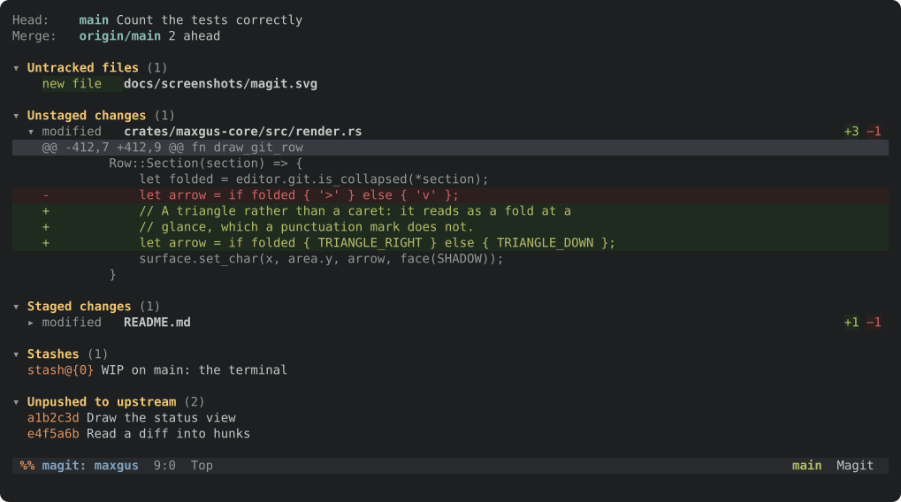

Magit's arrangement, for magit's reason — **a commit is assembled by looking
at the change, not by remembering it**. Every key acts on the row point is on:
`s` stages a file when point is on a file, **one hunk** when point is on a
hunk, and the whole section when point is on the heading. `u` unstages the
same way, `k` discards, `TAB` folds whatever is under the cursor. `n` and `p`
move by *section*, `M-n`/`M-p` by sibling, `^` out to the parent.

**`?` shows what git can do here**, and every prefix opens a menu of its own:

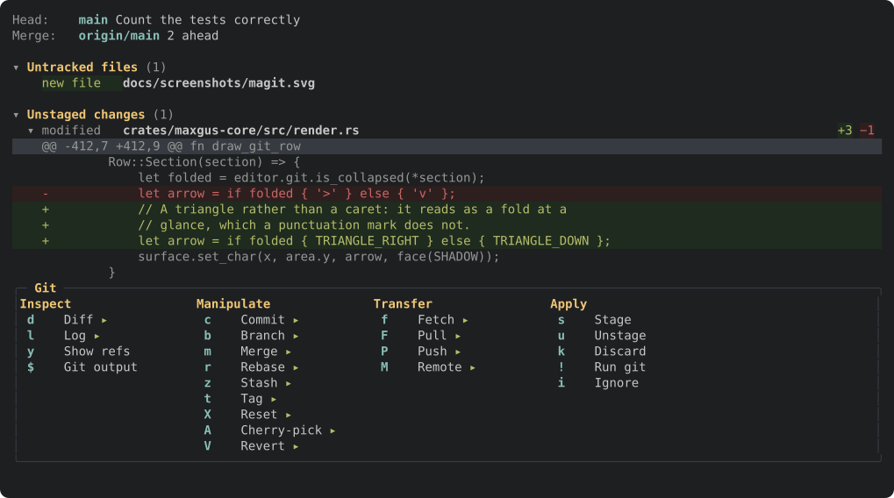

These are magit's transients, and they are why magit is usable without being
memorised: `P` shows what pushing means here *and whether
`--force-with-lease` is on* before it happens, rather than requiring the whole
of `git push` to be held in the head. Switches toggle with `-f`, `-u` and the
rest, stay lit while the menu is up, and are handed to the command that runs.
A menu takes every key while it is showing, so nothing underneath is quietly
competing with it, and `C-g` backs out one level at a time.

**Six buffers, as magit has them:**

| | |
|---|---|
| **status** `C-x g` | Everything at once, folding |
| **diff** `d` | Unstaged, staged, worktree, or a range |
| **revision** `RET` on a commit | Author, date, message and the full diff |
| **log** `l` | Commits with their refs, `RET` to open one |
| **refs** `y` | Branches, remotes and tags; `RET` checks one out |
| **process** `$` | Every git command run, and what it said |

Staging a hunk works the way magit's does: a patch containing that hunk alone,
handed to `git apply --cached`. `maxgus-git` builds it, and its tests build a
repository, take git's own diff, write the patch and hand it back to git — a
patch that is merely plausible is a patch that loses work.

Magit's keys, key for key: `c` commit, `b` branch, `m` merge, `r` rebase, `z`
stash, `t` tag, `X` reset, `A` cherry-pick, `V` revert, `f` fetch, `F` pull,
`P` push, `M` remote, `!` run git, `i` ignore, `g` refresh, `q` close. A commit
message is written in a buffer with the editor's own keys and finished with
`C-c C-c`, because a commit message is prose.

`q` **kills** the view rather than burying it — magit's buffers are working
views, and buried they collect in `C-x b` to be killed by hand later. What
comes up is where the view was opened from: a commit goes back to its log, the
log to the status, the status to the file you were editing. `C-u q` buries
instead, for a diff worth keeping open.

Discarding is the one thing here that cannot be undone, so it asks first —
and says exactly what it is about to lose.

### A terminal along the bottom, with tabs

`C-x t v` opens it. Every tab is a real shell on a real pseudo-terminal, and
the tab names itself after whatever the program running in it calls itself:

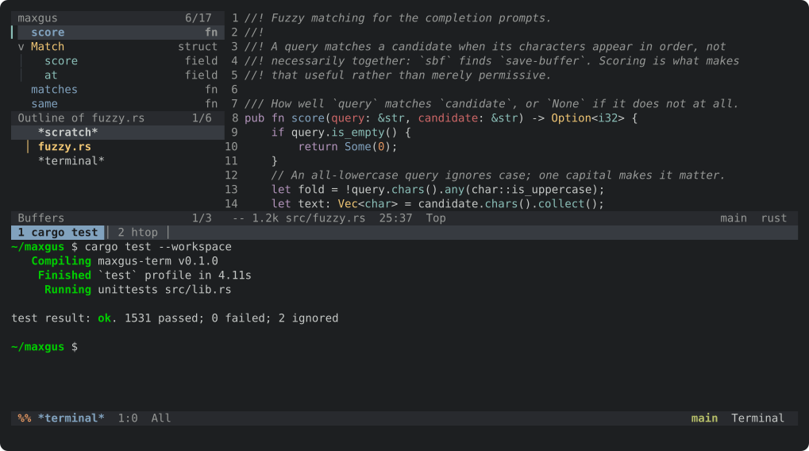

The emulator is written here — a grid with scrollback, twenty-four-bit colour,
scrolling regions, insert and delete, the alternate screen (so `vim` takes the
terminal and gives it back untouched), bracketed paste, and window titles.

**Keys go to the shell, not the editor.** `C-a` is readline's, `<up>` walks the
shell's history, and the arrows change spelling when the program asks them to.
`C-c` is the prefix for everything else: `C-c t` a new tab, `C-c n`/`C-c p`
between them, `C-c 1`…`C-c 9` straight to one, `C-c k` to close, `C-c C-y` to
paste.

Four keys stay the editor's — `C-x`, `M-x`, `C-h` and `C-g` — so a terminal can
never trap you in it. Each is given straight back: `C-c x`, `C-c c`, `C-c g`
and `C-c h` send the real thing.

**`C-c C-t` reads instead of typing.** Keys stop reaching the shell and move a
cursor over the output instead, so `C-SPC` marks and `M-w` copies to the kill
ring — character-wise, whole lines with `V`, or a rectangle with `C-x SPC` for
pulling one column out of a table. A line the terminal wrapped comes back as
one line, because it was one line when it was written.

`set shell="/bin/fish"` if `$SHELL` is not what you want.

### Asynchronous, and it means it

Every file read, directory walk, subprocess and language-server request runs on
tokio; parsing runs on tokio's blocking pool so a large file cannot stall the
runtime. Commands themselves are **synchronous** — a command is
`fn(&mut Editor, &Args) -> Result<()>` that queues work rather than awaiting —
which is why the whole command set is testable with no runtime, no terminal and
no filesystem.

A test walks the source and fails on a blocking call anywhere off the startup
path.

### It tries not to lose your work

- A file that is not text opens **read-only**, rather than being decoded, edited
  and written back with every unreadable byte replaced.
- A file **changed on disk** since it was read is not written over.
- `C-x C-w` will not quietly replace a file that already exists.
- Every destructive command refuses and names its override rather than asking
  for forgiveness.

---

## Finding the keys

Stop in the middle of `C-x` or `C-c` and a panel along the bottom says what
the next key can be — `which-key`, which is how Doom's leader is meant to be
learned rather than memorised. Keys that open another map are shown as the
group they open (`+file`, `+code`) rather than listed one row per binding.

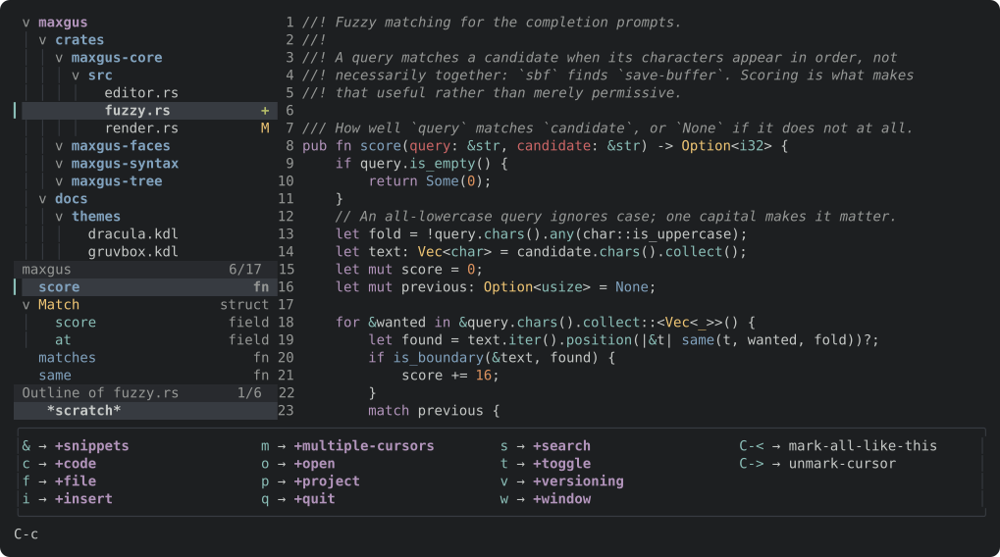

`set which-key=#false` turns it off, `set which-key-delay-ms=` changes how
long the pause is. It is in both builds.

## Keys worth knowing

The bindings follow **Doom Emacs' non-evil scheme**: the classic Emacs keys
are all where they have always been, and Doom's leader — `C-c` — carries the
same maps it carries there. `C-c c` is code, `C-c f` files, `C-c s` search,
`C-c o` open, `C-c t` toggles, `C-c v` git, `C-c m` cursors, `C-c i` insert,
`C-c q` quitting. `C-c l` is left alone, because that is Doom's localleader,
and so is `C-c e`, which is its eval key.

The full list is `C-h b`, inside the editor. These are the ones worth knowing
first.

| Key | Does |
|---|---|
| `C-x C-f` | Visit a file |
| `C-x C-s` | Save |
| `C-x C-w` | Save under another name |
| `C-x C-c` | Leave |
| `C-x b` | Switch buffer — lists them as it opens |
| `C-x k` | Kill a buffer |
| `M-x` | Run a command — a fuzzy-matched popup of all of them |
| `C-c s p` | Search the whole project |
| `<up>` `<down>` | In a prompt: walk the candidate list |
| `<prior>` `<next>` | In a prompt: a page of candidates at a time |
| `C-g` | Cancel |
| `C-x 2` `C-x 3` | Split below, split right |
| `C-x 0` `C-x 1` | Delete this window, delete the others |
| `C-x o` | Other window, cycling |
| `C-<left>` `C-<right>` | The window to the left, to the right |
| `C-<up>` `C-<down>` | The window above, below |
| `C-S-<up>` `C-S-<down>` | Make this window shorter, taller |
| `C-S-<left>` `C-S-<right>` | Make it narrower, wider |
| `C-d` | Duplicate the region, or this line |
| `C-SPC` | Set the mark |
| `C-w` `M-w` | Kill the region, copy it |
| `C-y` `M-y` | Yank, then cycle back through the kill ring |
| `C-/` `C-M-/` | Undo, redo |
| `C-s` `C-r` | Incremental search forward, backward |
| `M-%` | Query replace |
| `M-g g` | Go to line |
| `M-;` | Comment or uncomment |
| `M-q` | Fill the paragraph |
| `M-h` `C-M-h` | Mark the paragraph, the definition |
| `C-x z` | Repeat the last command |
| `C-x U` | Show the undo history as a tree |
| `C->` `C-<` | A cursor at the next / previous occurrence |
| `C-c C-<` | A cursor at every occurrence |
| `C-x d` | Open a directory as a buffer |
| `C-x t t` `<f9>` `C-s-a` | Toggle the side panel |
| `C-x t 1` / `2` / `3` | Select the tree, the outline, the buffer list |
| `C-x t v` | Toggle the terminal panel |
| `C-x g` `C-c v g` | Git status |
| `M-.` `M-,` | Go to definition, come back |
| `C-c c r` | Rename through the language server |
| `C-c c f` | Format the buffer |
| `C-h b` | Every binding |
| `C-h t` | The tutorial |
| `C-h v` | A setting's current value |
| `C-c t l` `C-c t I` | Toggle line numbers, tabs-or-spaces |
| `C-c f y` `C-c f Y` | Copy this file's path, its path in the project |
| `C-c f D` `C-c f m` | Delete this file, rename or move it |
| `C-c c w` | Delete trailing whitespace |
| `C-c f p` | Edit the configuration file |
| `C-c o b` | Open this file with the desktop's own viewer |
| `C-c i s` | Insert a snippet by name |

Inside the tree, treemacs' own keys apply: `n` and `p` to move, `u` for the
parent, `TAB` to fold, `RET` to open, `c f` and `c d` to create, `R` to rename,
`d` to delete, `y a` to copy the path, `?` for the rest.

`r d` draws the tree from the directory under the cursor instead, `r u` from
one further out, and `r r` from where it opened. Only the tree moves: the
project root a language server is told about, and that a project search
walks, stays where it was.

---

## Building it

The three builds are compared feature by feature [up there](#which-build).
The tree-sitter grammars are C, and they are most of what a `full` build
spends its time on — which is what makes `minimal` worth having rather than
a `cfg` nobody would use.

```sh
cargo build --release                                        # full
cargo build --release --no-default-features --features minimal
cargo build --release --features gui
```

To try them side by side, `./scripts/build-variants.sh` builds all three into
`target/variants/`:

```console
$ ./scripts/build-variants.sh
minimal  ok    4.6M  maxgus 0.2.4 (minimal)
full     ok     13M  maxgus 0.2.4 (full)
gui      ok     20M  maxgus 0.2.4 (gui)
```

`--debug` builds them faster, `--into DIR` puts them somewhere else. Every
binary's `--version` names which of the three it is, because they look
identical and are not — and a key a build does not have reports itself as
undefined rather than doing nothing:

```console
$ target/variants/maxgus-minimal notes.txt
C-x g is undefined
```

All three are built and tested by the CI, and a test holds every row of the
comparison: a command family is wholly in a build or wholly out of it, and
`minimal` growing one would mean it had grown the crate behind it.

## A window, as well as a terminal

`--features gui` adds a second front end. It is the *same* editor — the same
commands, the same keymaps, the same redisplay — drawn into a window by wgpu
rather than into a terminal by escape sequences, and which one it opens is
decided when it starts:

```sh
maxgus src/main.rs        # a window
maxgus -nw src/main.rs    # the terminal, spelled the way Emacs spells it
```

`-nw`, `--no-window-system` and `--tty` are the same flag, and every build
takes it so the habit works everywhere. With no session to draw into — over
ssh, say — it starts in the terminal by itself rather than failing; `--gui`
overrides that and insists on a window.

What the window has that a terminal cannot:

- **Smooth scrolling.** A terminal scrolls by whole lines because it cannot
  draw half of one. The window keeps a pixel offset and eases towards it, so a
  wheel notch slides three lines instead of jumping them — `mouse-wheel-lines`
  is how far a notch goes and `smooth-scroll-ms` is how long the slide takes,
  `0` for none. Only the window being scrolled moves — its mode line, the echo area and the file tree hold
  still — and the line arriving is drawn into the fraction of a row that
  opens up at the edge, clipped where the window ends.
- **The mouse.** Click to put point where you clicked, drag to select, middle
  button to paste, wheel to scroll. A click in another window selects it; a
  turn of the wheel over one scrolls it without selecting it, so the wheel
  over the file tree moves the file tree.
- **The system clipboard**, rather than a terminal's guess at one.
- **Suggestions while you type.** After a couple of letters of a word the
  language server is asked what could follow, and a list appears at the
  cursor with each candidate's kind and type beside it. Typing narrows it,
  `C-n`/`C-p` or the arrows move, `RET` or `TAB` takes one, `C-g` puts it
  away — and every other key goes into the buffer, which is what makes the
  list something you type through rather than something you escape from. A
  pause never inserts anything on its own; only `C-M-i` on a single
  candidate does that. `set autocomplete=#false` turns it off.
- **A box beside the symbol under the cursor**, once it has rested there,
  saying what the language server knows about it, the way lsp-ui-doc does.
  What arrives is markdown — a heading, a rule, the parameters, the prose,
  the signature in a fenced block — and it is drawn as those things rather
  than as the punctuation that spells them: headings bold, code on a panel
  of its own, `---` as a rule across the box, `- ` as a bullet. `set
  lsp-doc=#false` turns it off; `C-c c k` asks for it either way. The
  terminal front end draws the same box:

  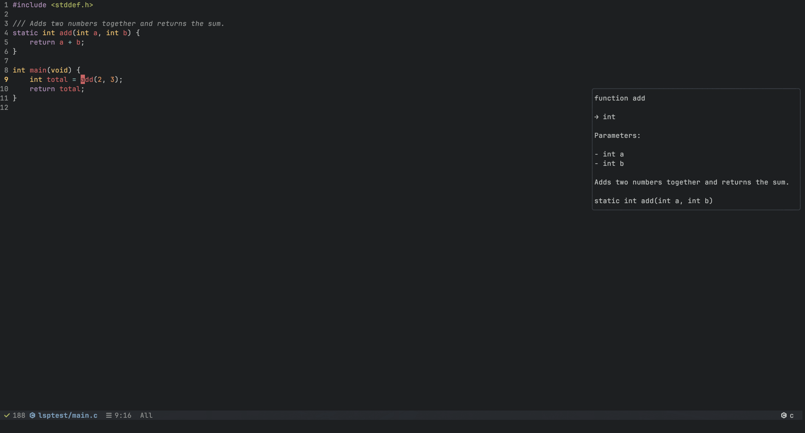
- **A window that behaves like one.** Its title is the buffer being edited,
  with a `*` while there is unsaved work in it; the close button runs the
  same command `C-x C-c` does, so it refuses to throw that work away; and it
  sleeps when nothing is happening rather than redrawing a still screen
  sixty times a second.
- **Any font on the system**, at any size: `set gui-font` and
  `set gui-font-size`. Sized in physical pixels, so it is the same size on a
  display that reports a scale as on one that does not. Bold and italic are separate faces where the system has
  them and fall back to the regular one where it does not, so an emphasised
  word is never an invisible one.

`C-c o b` (`M-x open-externally`) hands the file being edited to whatever the
desktop opens it with — an image viewer for an image, a reader for a PDF —
using `xdg-open`, `open` or `start` as the platform requires. It works from
the terminal front end too.

## Configuring it

`~/.config/maxgus/config.kdl`, in [KDL](https://kdl.dev). **`C-c f p`** opens
that file — creating it if this is the first time — so the editor is edited
from inside itself:

```kdl
set tab-width=4 theme="maxgus-dark" line-numbers=#true

keymap "global" {
    bind "C-c f" "lsp-format-buffer"
    unbind "C-z"
}

theme "maxgus-dark" {
    face "font-lock-comment" fg="#5f6b73" italic=#true
}

lsp "rust" command="rust-analyzer" {
    root-markers "Cargo.toml"
}

tree { width 32; ignore ".git" "target" }
```

A KDL node is "a name, some arguments, some properties, optionally a block" —
which is exactly the shape of a keybinding, a face, a server and an ignore rule.
One small pure-Rust dependency, no VM, no startup cost. Every binding names a
**command from the registry**, so configuration reaches anything the editor can
do without becoming a program.

| | |
|---|---|
| [**Configuration reference**](docs/configuration-reference.md) | Every option, its type and its default |
| [Why KDL](docs/configuration.md) | And what was rejected: TOML, a Lisp dialect, Lua, RON |
| [Worked example](docs/config.example.kdl) | Every option in one annotated file |
| [Example themes](docs/themes) | Gruvbox, Nord, Dracula, Solarized Light |

Unknown settings get a "did you mean"; unknown faces are reported with the line
they are on. Documentation that has drifted is a bug here — tests assert the
example config exercises every setting and every face attribute the parser
accepts.

---

## Layout

Twelve crates, `unsafe_code = "forbid"` across all of them.

| Crate | What it holds |
|---|---|
| `maxgus-text` | Rope buffers, point and mark, grouped undo, kill ring, registers, motions, search |
| `maxgus-keys` | Emacs key notation, keymaps, global/mode/minor precedence |
| `maxgus-config` | The KDL parser |
| `maxgus-faces` | Colours, faces, themes, colour degradation |
| `maxgus-syntax` | Tree-sitter grammars and incremental highlighting |
| `maxgus-lsp` | JSON-RPC framing, position encoding, the client |
| `maxgus-tree` | File tree model, git status, the treemacs keymap |
| `maxgus-git` | Reading git: status, diffs, logs, and the patches that stage a hunk |
| `maxgus-term` | Terminal emulator: grid, escape sequences, selection, key encoding |
| `maxgus-tui` | Cell grid, frame diffing, terminal setup, job control |
| `maxgus-core` | Buffers, windows, minibuffer, commands, dispatch, redisplay |
| `maxgus` | The event loop and the task executor |

## Testing

**2036 tests.** Unit tests beside the code; session tests that press real keys
through the real keymap and assert on the rendered screen; smoke tests that open
a pseudo-terminal, run the built binary and read what it draws — including
against a real `clangd`.

Plus a reproducible pseudo-random walk over the entire keymap that presses
bindings, answers prompts, redraws and checks invariants after every step. It
prints the seed and the key sequence when it fails, which reproduces exactly.

The habit that has found the most: **sabotage the code and check the test
fails.** A test that has never been observed to fail is a hypothesis, not a
check.

## Releasing

What changed in each release is in [CHANGELOG.md](CHANGELOG.md). Tagging is
the whole of publishing one:

```console
$ git tag v0.2.4 && git push origin v0.2.4
```

[`.github/workflows/release.yml`](.github/workflows/release.yml) builds all
seven targets — three Linux, two macOS, Windows and a cross-compiled FreeBSD —
and every build each of them can carry: `minimal` and `full` everywhere,
`gui` where a window system is there to compile against. Each archive gets a
checksum beside it, and all of them are attached to the release.

The site publishes itself from
[`.github/workflows/pages.yml`](.github/workflows/pages.yml) whenever
`site/` or the screenshots change, which is also what keeps
`install.sh` pointing at the latest release.

---

<div align="center">

**MIT** · built in the open at
[github.com/alejandro-llanes/maxgus-editor](https://github.com/alejandro-llanes/maxgus-editor)

</div>
